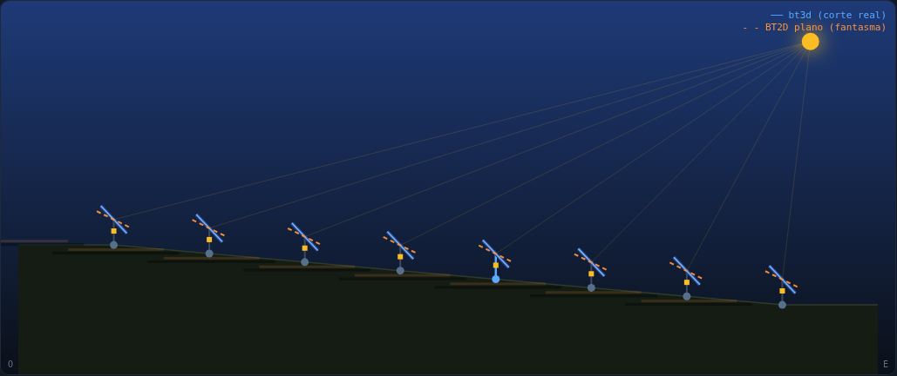

# Cobertura Zigbee — El Burgo I

> Visor "máquina del tiempo" + recolectores para medir y reproducir la cobertura de la malla Zigbee de seguidores (TCU) de la PSFV El Burgo I sobre un mapa satélite.

## Qué es

Un paquete para medir la red Zigbee **ya desplegada** en planta (no instala nada nuevo en campo) y representarla sobre el satélite: nivel de señal, nodos sin respuesta, fiabilidad del enlace, **saltos** de cada paquete y **criticidad** de cada nodo. Dos recolectores PowerShell consultan el gateway Digi ConnectPort X2 (XBee ZB 2,4 GHz) y escriben CSV; el visor (un único HTML, `index.html`) los pinta y los reproduce sobre una línea de tiempo.

```
zigbee_logger.ps1 ──HTTP/RCI(80)──┐
                                  ├─► Digi ConnectPort X2 (coordinador + 52 TCU + HSU, malla)
zigbee_routes_logger.ps1 ─telnet(23)─┘
        │  zigbee_log.csv / zigbee_routes.csv
        ▼
   index.html  (mapa satélite + máquina del tiempo)
```

## Funcionalidades

- **Recolector RSSI/estado** (`zigbee_logger.ps1`, HTTP/RCI): RSSI, online/offline, fallos de ACK. Autodescubre nodos; vigila varios gateways a la vez.
- **Recolector de rutas** (`zigbee_routes_logger.ps1`, telnet): saltos y topología (`xbee source_route`). Autodescubre nodos.
- **Visor** (`index.html`): mapa satélite Leaflet + línea de tiempo (play, paso a paso, scrub, velocidad 1–8×, bucle, tira roja de incidencias).
- **Modos de color**: RSSI, Estado (cobertura real), ACK fallos, Saltos (profundidad al coordinador) y Criticidad (puntos únicos de fallo).
- **Rutas/topología**: clic en un TCU dibuja su cadena de saltos al gateway; opción de dibujar toda la malla; gateway reubicable sobre el mapa.

## Uso

1. Edita la **IP** y las **credenciales** del gateway al principio de cada `.ps1` (`$Gateways`/`$GwHost`, `$User`/`$Pass`).
2. Lanza los recolectores (en ventanas separadas), déjalos correr el periodo a medir (ideal: un día completo, incluido un *stow*):
   ```powershell
   powershell -ExecutionPolicy Bypass -File .\zigbee_logger.ps1
   powershell -ExecutionPolicy Bypass -File .\zigbee_routes_logger.ps1
   ```
3. Abre **`index.html`** y carga los tres CSV (registro RSSI, coordenadas, rutas). Para probar sin datos reales, pulsa **"Datos de ejemplo"**. Teclado: espacio = play, flechas = paso.

> Para ver saltos/criticidad *evolucionar* hace falta que `zigbee_routes.csv` tenga varias capturas dentro del mismo periodo que el log de RSSI (la línea de tiempo la marca el RSSI).

## Stack

- Visor: **HTML + JavaScript + Leaflet** (teselas satélite), un único fichero `index.html`, sin build.
- Recolectores: **PowerShell** (incluido en Windows; no requiere instalación ni administrador).
- Gateway: Digi **ConnectPort X2**, XBee ZB **2,4 GHz canal 14**; RSSI/estado por **RCI** (HTTP), rutas por **CLI telnet**.
- Datos: CSV (`zigbee_log.csv`, `zigbee_routes.csv`, `coords_ElBurgo_NCU1.csv` con `node_id, lat, lon`).

## Despliegue

Publicado como página estática en GitHub Pages: **https://imoriana3.github.io/cobertura-zigbee/**

`index.html` es autónomo; basta servir el fichero. El visor descarga las teselas del satélite por internet (sin conexión funciona igual, sin fondo de mapa).

## Notas

- **El RSSI no es el mapa de cobertura**: es el nivel del último salto al vecino, no la distancia al coordinador. La cobertura real la dan `Estado` (hay ruta o no) y `ACK fallos` (enlace que retransmite). La **criticidad** marca los relés de los que dependen otros nodos.
- Las **rutas son una foto** de cada captura; la malla se reorganiza sola entre rondas.
- El **mapeo de IDs** a coordenadas lleva una hipótesis (orden de strings de la nomenclatura `1.X.Y`); valídala con un TCU conocido antes de sacar conclusiones de posición exacta.
- No bajes mucho los intervalos en producción: cada ronda compite con el tráfico de control de la NCU (5–10 min está bien).

## Simulador de Backtracking (`backtracking.html`)

Este repo aloja también el **Simulador de Backtracking**: un espejo JS del motor BT3D de SolarGPT
(`tracker3d.py`) con el inventario COMPLETO de políticas de backtracking del core —astronómico ·
BT2D plano · global · row · pairwise · true-3D · min-ground-light · energy-optimal (Deeptrack)— sobre
terreno 3D editable (pendiente E-O por pareja + tilt N-S por fila), los tres accionamientos
(**monofila, bifila rígida y bifila quebrada**, backtracking resuelto a nivel de accionamiento) y la
implantación real a lo largo del eje (cortos delante de largos, tresbolillo — con el solape axial en
la física). La escena 3D usa el **modelo del seguidor de la casa** (`seguidor.js`, tamaño medio real
incluido) con sombras por shadow-map; corte 2D como editor de terreno, curvas θ(t), POA por política
(Ineichen + Perez + Martinez) y estimación anual. Un único HTML offline.

### Careo: clásico vs bt3d

El simulador traía los dos modelos, pero el clásico era una degradación a la que se caía, no una
comparación que se enseña. La casilla **CAREO clásico vs bt3d** (panel *Terreno transversal*) los pone
frente a frente **sobre el mismo corte y el mismo día**:

- **dos trayectorias θ(t)** superpuestas — el clásico (`BT2D plano`, pvlib sin pendiente: el tracker sin
  configurar) y el bt3d (bisección 3D sobre el corte editado). El resto de políticas se apagan mientras
  dura el careo: con cinco curvas encima no se lee nada. Al apagarlo vuelve el estado anterior tal cual;
- **los dos fantasmas en el corte 2D**: el bt3d sólido y el clásico a trazos, cada uno con su sombra al
  suelo y con la porción sombreada de cada mesa en rojo — se ve dónde el clásico sombrea a la vecina y
  dónde desperdicia ángulo;
- **la cajita del día**, pensada para captura: Δ de POA **con su banda del circunsolar** (la misma
  convención que la tabla: misma cota arriba y abajo, y **ámbar si cruza el cero** — entonces el careo
  tampoco decide), minutos de sombra evitados, la hora peor del clásico con su sombra media de planta, y
  la pérdida eléctrica de cada uno. Cada porcentaje lleva **su denominador declarado**, porque la
  captura acaba en una oferta donde nadie recuerda contra qué se comparó.



Con **+ modelo de libro** (opcional, apagada por defecto) el mismo mando clásico se mide además como lo
mide una simulación de fila infinita y terreno plano —lo que asume un PVsyst/pvlib de manual— y la
cajita **descompone** la diferencia: implantación axial + relieve + control. Es la respuesta a una IE
que ha simulado con el modelo de libro: en vez de un delta a secas, cuánto pesa cada simplificación.

Medido sobre pendiente del 9 % (21-jun, 8 filas, monofila), con la óptica de la v1.31:

| | POA planta | vs. clásico |
|---|---|---|
| bt3d | 11,256 kWh/m²·d | **+2,66 %** [+2,37 … +2,97] |
| BT2D plano (clásico) | 10,964 kWh/m²·d | — |
| Modelo de libro (fila infinita, plano) | 11,340 kWh/m²·d | descompuesto: **+0,00 %** axial · **−3,32 %** relieve · **+2,57 %** control |

Tres botones de demo (**Pendiente 9 %**, **Vaguada 2 m**, **Cresta 2 m**) son atajos sobre los presets
de terreno que ya existían, con los **valores clavados**: dos capturas del mismo preset tienen que dar
los mismos números. El camino manual —arrastrar los postes o poner tus valores en el panel— queda
intacto.

> **Cero física nueva.** El careo no añade un modelo: usa los dos que ya vivían en el fichero y la
> misma integral del día (`kpisSerie`, una sola maquinaria con dos puntos de entrada, con la banda y la
> sombra ponderada de la v1.31). El «modelo de libro» es un **dato**, no una física: el mismo terreno
> con las pendientes a cero y sin tramos axiales (el camino «sin `T.segs`» que ya existía). Por eso el
> libro vive en los números y no en una tercera curva: el mando de `BT2D plano` no depende del relieve,
> así que dibujarlo sería pintar la misma línea encima. Sanity check de la aceptación: **terreno plano
> ⇒ Δ = 0,00 %**, banda incluida.

- Física portada 1:1 (pvlib `singleaxis` A&M 2020, sombra ≡ Anderson 2023, bisección 3D, residual de
  tangencia) y **QA integrada**: botón en la página y `node tools/test_backtracking_sim.mjs` corren la
  misma batería (25 comprobaciones, incluida sombra analítica vs ray-cast bruto).
- Documentación completa: `proyectos/docs/backtracking-sim.md` (botón Documentación de su ficha en el Panel).

## Telemetría de planta — ¿corrige el relieve? (`telemetria.html`)

Una página, un botón, una respuesta: **¿esta planta está corrigiendo el relieve o manda un ángulo
único a todos sus seguidores?**

Lee la tabla `telemetria` de Supabase —donde `factiun-cartera/importar-logs.html` deja los CSV
diarios de las NCU— y mide **cuánto se abren entre sí los objetivos de los seguidores** a lo largo
del día. No compara contra ningún modelo, así que no hace falta levantamiento ni geometría:

* con eje N-S, el ángulo **astronómico es casi el mismo para toda la planta** a cualquier hora;
* el **backtracking 3D abre** los ángulos, porque cada seguidor lleva la pendiente de su vecino.

Medido sobre el levantamiento de Ayora, la separación entre las dos firmas es de **0,4° a mediodía
pero ≈12° al ocaso**. Por eso la página juzga por los **extremos del día** y avisa de que al cenit
las dos firmas coinciden y no distinguen nada — un control no es una prueba.

Detalles que la hacen fiable y no un gráfico bonito: la apertura es **p95 − p5**, no máx − mín (un
solo seguidor en tope falsearía el máximo todos los días); los que están **en posición segura** se
excluyen; y el remuestreo a malla común **descarta** la muestra si cae a más de media malla, en vez
de arrastrar un valor viejo — los logs de TCU pierden en torno al 7 % del día en decenas de huecos
de radio, y rellenarlos en silencio inventaría apertura donde no la hay.

**Hace falta sesión.** La política de la tabla es `for select to authenticated`, así que con la clave
pública a secas la consulta responde **200 con cero filas** — no da error, simplemente no ve nada, que
es la forma más traicionera de fallar. Tres vías, en este orden:

1. **Ninguna**, con suerte: si ya has entrado alguna vez en `importar-logs.html`, supabase-js dejó tu
   sesión en el `localStorage` de ese origen. Esta página vive en el mismo, así que **la reutiliza
   sola** —y la renueva con su `refresh_token` si ha caducado—. Lo dice en el registro en vez de
   entrar en silencio.
2. **Entrar con GitHub**, que es como se autentica la casa en Supabase — ahí no hay contraseña que
   teclear. Es una navegación al `authorize` del proyecto y vuelve con el token en el fragmento.
3. **Un enlace por correo** (*magic link*), si el navegador donde miras no es el de la sesión.
4. **Correo y contraseña**, si el proyecto las tuviera.

Las vías 2 y 3 necesitan que esta dirección esté en las *Redirect URLs* del proyecto de Supabase; si
no lo está, la autenticación funciona pero te devuelve al *Site URL* configurado allí. La página pide correo y contraseña (las mismas de
`importar-logs.html`), las manda **solo** a tu Supabase y **no las guarda**: en la pestaña queda el
token, que caduca solo. Y distingue en el registro entre «cero filas SIN sesión» y «cero filas CON
sesión», que son dos problemas distintos.

El botón **Descargar remuestreado** deja un JSON pequeño con la malla ya calculada, que es lo que
hay que compartir para analizarlo fuera.

QA: `node tools/test_telemetria.mjs` (27 comprobaciones) — prueba la página con datos sintéticos
**en las dos direcciones**, porque una que solo acertara con el caso bueno no distinguiría nada, y
fija que la contraseña no se guarda y que el «cero filas» se explique según haya sesión o no.

*Factiun · proyecto interno.*
